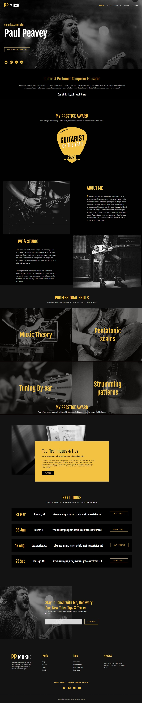

<!--markdown-->
#pp guiter lesson website(CMBD-246)
--- 
### From: websitedemos.net-customize=template
#### HTML, CSS3, JavaScript
 

 

-  I’m Using  __Menu/Responsive menu__.
-   __Logo slider animation__.
-  __User and Log in Pop up__.
-  Display on
-  1. Flex, grid.
   2. Responsive card, container, animation
   3. position fixed, hover, search engine, header and footer.
   4. aside, form, filter.

-  Ask me about `HTML, CSS and JS`.

 
   https://github.com/SUMITSARKAR89/language-tutor-website/tree/master
     
Demo https://master--earnest-squirrel-22469f.netlify.app/
    
   ### __"There is no friend as loyal as a book"__ 

 
All rights reserved by Sumit sarkar @2022

<!-- --link-- -->
[facebooklink]: https://www.facebook.com/sumitsarkar89
[linkedinlink]:https://www.linkedin.com/in/sumitsarkar89/
[gmaillink]: www.sumitopticalit89@gmail.com
[githublink]: https://github.com/SUMITSARKAR89
[cvlink]:https://drive.google.com/file/d/1CTEwnPjn2WZW2E9qf5NDFViXcVLVEMD-/view?usp=drive_link

